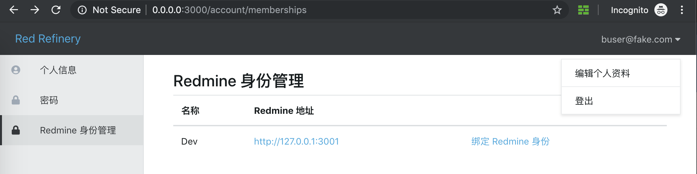
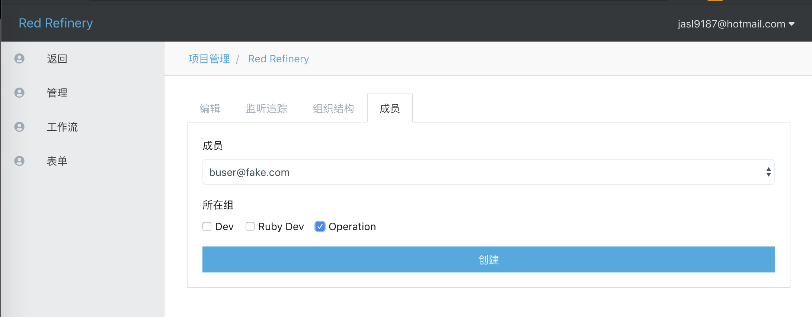

功能点说明
====

## 注册、登录

略

## 绑定 Redmine 身份

登录后，点击右上角用户名（邮箱），编辑个人资料，在左侧导航选择"Redmine 身份管理"

页面内列出了所有登记的 Redmine 实例，点击对应实例的 "绑定 Redmine 身份"

会切换到对应的 Redmine，点击 "Approve"（同意）

返回 OA 服务，绑定成功，返回首页可以看到已加入的 Redmine 实例

如果用户在对应的 Redmine 是管理员，则进入租户页面，则会显示管理功能（普通用户没有）

## Redmine 管理员：添加项目

注：只有进行 "绑定 Redmine 身份" 前为 Redmine 管理员才可使用。

从首页"加入的项目"中选择相应的 Redmine 实例，进入租户管理后台，点击项目，点击添加，填写表单即可

## 项目管理

在项目管理页面，点击对应项目的"编辑"按钮，即可进入项目的管理后台

### 组织结构管理

略

### 成员管理

将已加入到租户（绑定过 Redmine 身份）设置项目的组织结构，即可将用户加入到项目中

加入到项目的用户的首页可以看到对应的项目，所有实际业务功能均在其中

### 表单

略

### 流程

注：由于没有设计器，目前通过 `workflow.seed!` 构造 Demo 流程。

创建流程需要关联表单

#### 流程配置

一些迁移支持配置，包括审批人和表单可见性均在其中配置

## 日常使用

从首页"加入的项目列表" 进入项目页面，以进行日常操作
