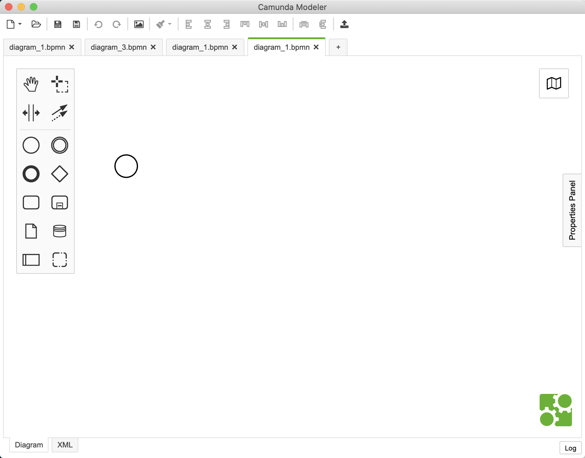
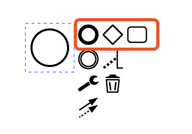
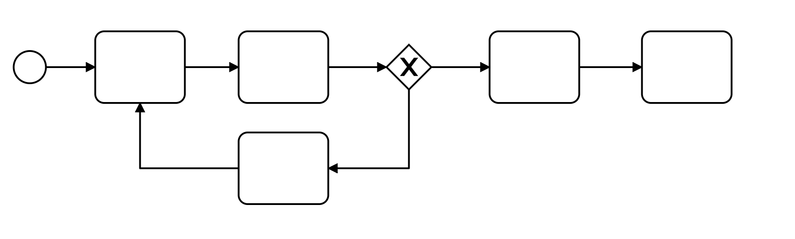
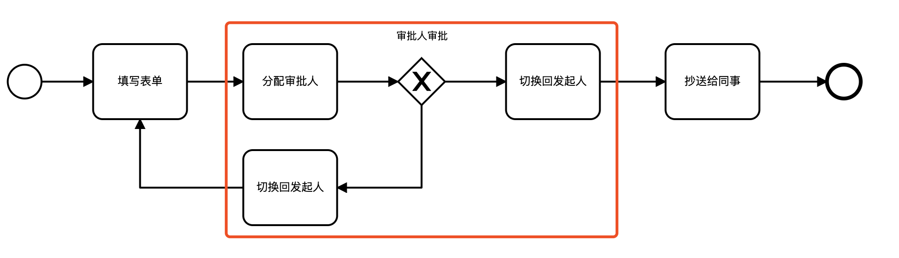
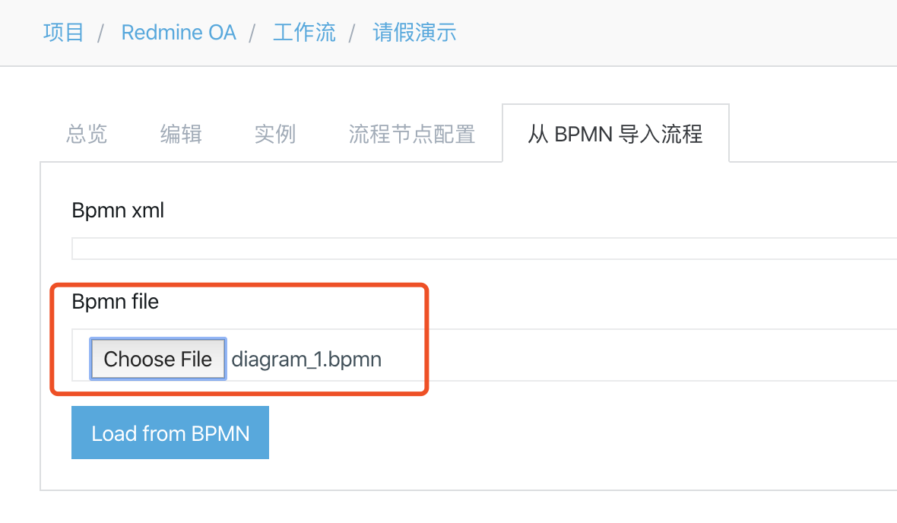
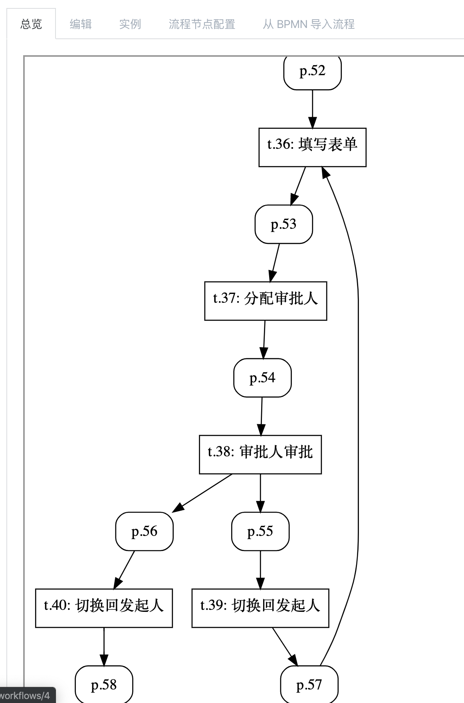
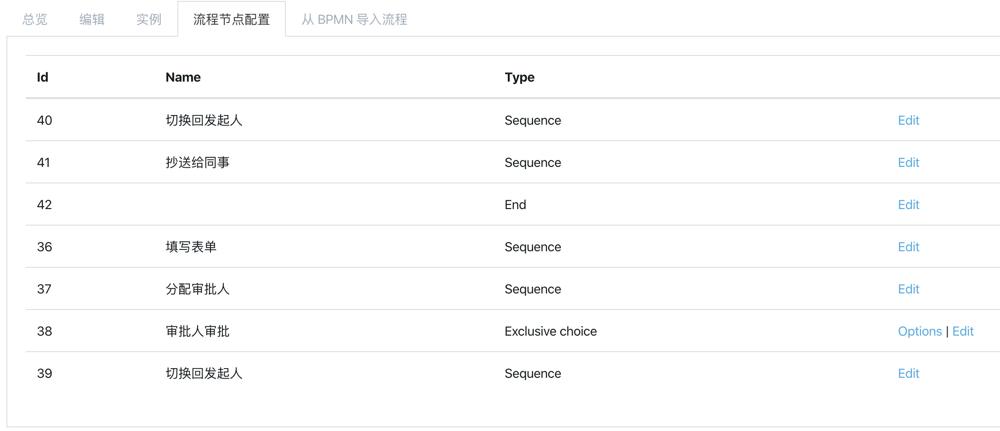
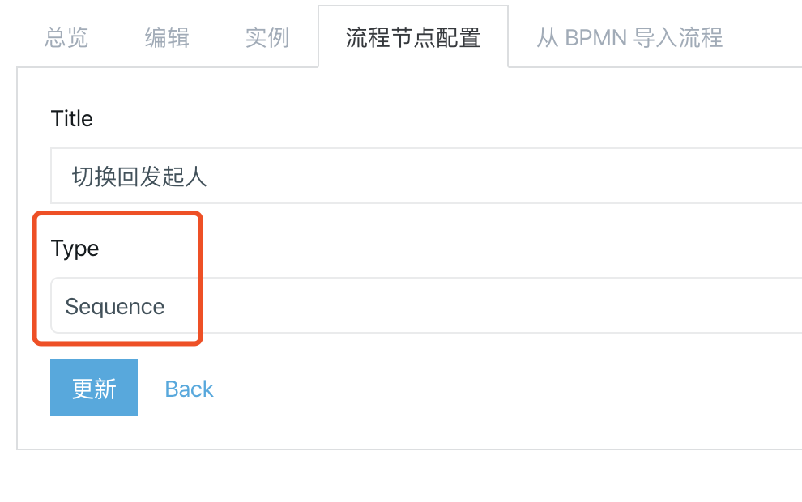
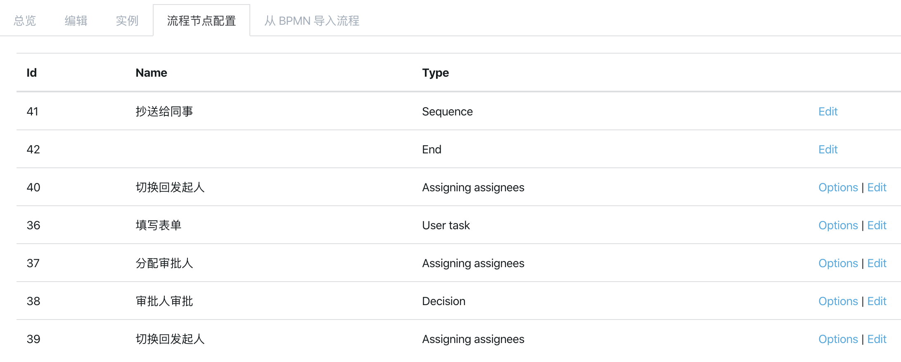

工作流
====

基于类 PetriNet 的可扩展流程引擎

## 支持的流转方式

流转方式的代码位于 `app/models/transitions` 目录下

### 流程开始

代码 `start.rb`

略

### 流程结束

代码 `end.rb`

结束时将表单数据持久化入流程关联的表单

注：如果持久化时错误将抛出异常

### 基于规则（而非人工）的排他性分支

代码 `exclusive_choice.rb`

需要配置条件（基于 mruby 脚本，传入表单数据，需返回布尔值），
流转时会根据条件选择最适合的一条分支继续

### 并行分支

代码 `parallel_split.rb`

流转时会同时触发两个分支，通常配合 "同步" 流转（见下文）使用，
即并行执行多个分支，等所有分支都处理完后，再继续流程

### 同步

代码 `synchronization.rb`

通常配合 "并行分支" 使用，等待所有输入的流程分支都处理完后再继续流程

### 简单合并

代码 `simple_merge.rb`

### 序列

代码 `sequence.rb`

业务流程节点的基类，不应直接使用（因为没有意义）

### 分配审批人

代码 `variants/assigning_assignees.rb`

**重要：节点的审批人由上一个流程节点产生的 Token 决定，当需要改变审批人时，则需要插入该节点**

用于配置接下来的流程的审批人，支持指定组或者特定成员，支持指定一个或者多个。

注：分配多个审批人时，通过策略以及 Token 的回收理由下一个节点决定（参见 `app/models/concerns/transitions/options/votable.rb`），
目前仅有 "抉择" 实现了它。

### 投票

代码 `variants/decision.rb`

可以设置 "同意"、"否决" 两种情况分别流转到哪个分支

注：实现了 `Votable` 故支持接受多个 Token （通常由 "分配审批人" 产生的），目前仅实现了 "一票通过"、"一票否决" 策略

### 选择

代码 `variants/choice.rb`

由人工决定流转到哪一个分支

### 同步到 Redmine

代码 `variants/sync_to_redmine.rb`

将流程表单的数据同步到 Redmine 关联的 Issue 去，可以配置表单字段如何映射到 Redmine Issue

注：只有通过监听 Redmine 创建的审批才有效（因为创建审批时会关联 Redmine Issue），否则自动跳过

### 用户任务

代码 `variants/user_task.rb`

用于人工填写表单

## 支持的特性

### 流程转发

支持转发到任意项目成员

### 加签

支持转发到任意项目成员

### 传阅

支持转发到任意项目成员

### 项目管理员强制审批

项目管理员可以在工作流管理后台代理审批人进行审批

### 关闭流程

流程可被发起人或管理员关闭

## 导入流程

### 代码方式

参考 `Workflow#seed!` 的代码

### 从 BPMN 导入

我们可以使用现成的工作流的可视化设计器来进行流程图定义的绘制，然后利用 `从 BPMN 导入` 功能来导入流程图的结构（而后需要对流程节点进行配置），推荐使用 Camunda Modeler。

下载地址：<https://camunda.com/download/modeler>

#### Camunda Modeler 使用

进入后新建文档后界面如图所示

新文档默认包含了“开始节点”（画布中黑色圆圈图形），鼠标点击后，图案右侧会展示一系列节点类型的图标，点击其中一个，即创建下一步流程节点。

如图所示，**仅支持红框框住的类型**

其中红框内的粗线圆圈图形为结束类型（流程最后一步后必须添加一个结束节点），方框图标为任务类型，菱形图标为分支类型。

红框外的垃圾桶图标为删除当前选中的节点，最下的箭头图标为连接线，用于手动连接两个节点。

基于这三种流程类型，可画出如图所示的流程图

双击节点，可编辑步骤说明

**特别注意：如上图所示红框内，由于本流程引擎和 BPMN 原理有差别，需要在分支类型节点的每一条线上加一个任务节点，用于指定和切换审批人员**

编辑完成后，点击保存按钮存盘

#### 在编辑流程中导入

可在 OA 系统工作流编辑页面的“从 BPMN 导入流程”页面导入刚刚保存的流程

选择好 `.bpmn` 文件后，点击按钮即可导入。

成功后，会切换会流程图页面，展示刚导入的流程

其中，圆角矩形代表流程流转后的状态，矩形代表流程节点。图中的标号为该节点的 ID，配置流程节点时会用到。

### 配置流程节点

导入流程后，需要配置流程节点，切换到“流程节点配置”页面

由于 BPMN 的节点类型和本工作流的节点类型不同，**首先需要修正节点类型**

对应导入的流程图的各节点 ID，点击各流程节点的“编辑”

红框内编辑流程节点的类型，有效的为这几种：

- User Task：审批人填写或预览表单
- Assigning Assignees：分配审批人
- Sync to Redmine：同步数据到 Redmine Issue，只有从 Redmine 回调创建的审批才有效，否则执行时会自动跳过
- Adding Observers：添加传阅人
- Decision：投票（通过或驳回）
- Choice：选择

依次纠正节点类型后，节点后会多出“选项”按钮，用于配置节点的规则，如：

- User Task：配置表单的访问控制（可编辑、只读、隐藏）
- Assigning Assignees：分配审批人（或用户组）
- Sync to Redmine：设置要同步的字段
- Adding Observers：设置要传阅给的人
- Decision：通过和驳回对应的节点，投票方式
- Choice：设置选项和对应的节点
